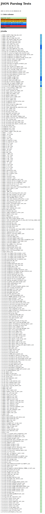

# JAXzilla


A JSON parser for Scala with SAX-style API.

The parser parses the document and dispatches events corresponding to the structure of the document.

<br clear="right" /><!-- Turn off the wrapping for the logo image. -->

## Installation

```scala
libraryDependencies += "com.github.gchudnov" %% "jaxzilla" % "1.0.0"
```

## Usage

Create an instance of `JsonHandler` interface and pass it to `JsonParser.parse` with the byte input stream, `ByteArrayInputStream`.
When parsed, a series of event will be generated. On completion, `JsonParser.parse` returns a result: `Either[Throwable, Unit]`.

```scala
import java.io.ByteArrayInputStream

import com.github.gchudnov.jaxzilla._

object DemoApp extends App {

  val handler: JsonHandler = new JsonHandler {
    override def onStartDocument(): Unit = { println("onStartDocument") }
    override def onEndDocument(): Unit = { println("onEndDocument") }
    override def onStartObject(): Unit = { println("onStartObject") }
    override def onStartKeyValue(): Unit = { println("onStartKeyValue") }
    override def onKey(key: String): Unit = { println(s"onKey: $key") }
    override def onEndKeyValue(): Unit = { println("onEndKeyValue") }
    override def onEndObject(): Unit = { println("onEndObject") }
    override def onStartArray(): Unit = { println("onStartArray") }
    override def onStartElement(): Unit = { println("onStartElement") }
    override def onEndElement(): Unit = { println("onEndElement") }
    override def onEndArray(): Unit = { println("onEndArray") }
    override def onStringValue(value: String): Unit = { println(s"onStringValue: $value") }
    override def onIntegerValue(value: Long): Unit = { println(s"onIntegerValue: $value") }
    override def onDecimalValue(value: Double): Unit = { println(s"onDecimalValue: $value") }
    override def onBooleanValue(value: Boolean): Unit = { println(s"onBooleanValue: $value") }
    override def onNullValue(): Unit = { println("onNullValue") }
  }

  val input = """{ "parser": "jaxzilla", "tags": [ "scala", 2.13 ] }"""
  val is = new ByteArrayInputStream(input.getBytes())

  val result: Either[Throwable, Unit] = JsonParser.parse(handler, is)

  // Right(())
}
```

When executed, the following events will be triggered:

```text
onStartDocument
onStartObject
onStartKeyValue
onKey: "parser"
onStringValue: jaxzilla
onEndKeyValue
onStartKeyValue
onKey: "tags"
onStartArray
onStartElement
onStringValue: scala
onEndElement
onStartElement
onDecimalValue: 2.13
onEndElement
onEndArray
onEndKeyValue
onEndObject
onEndDocument
```

## Tests

The parser was validated against [JSONTestSuite](https://github.com/nst/JSONTestSuite) with the following [results](res/report/report.html):




## Contact

[Grigorii Chudnov](mailto:g.chudnov@gmail.com)

## License

Distributed under the [The MIT License (MIT)](LICENSE).
